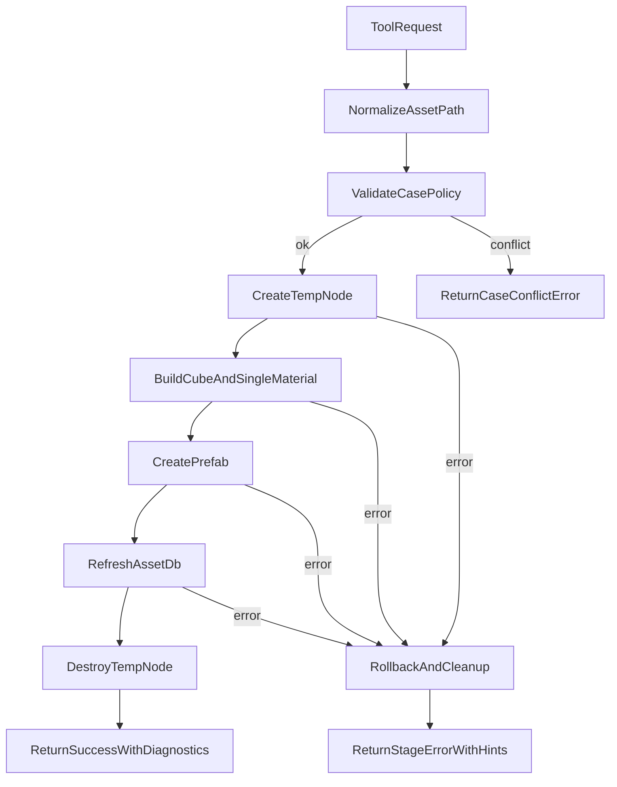

# Cocos MCP 预制体创建稳定性增强方案

## 目标
- 消除 `Prefabs/prefabs`、`Scripts/scripts` 大小写不一致引发的 AssetDB 缓存告警。
- 将“创建节点 -> 挂组件 -> 导出 prefab -> 清理节点 -> 刷新资产”改为可回滚、可诊断的原子流程。
- 在用户层输出“可操作”的错误信息，避免误判为 MCP 不稳定。

## 改造范围
- MCP 工具层：[`e:/gitproject/cocos/TestProject/extensions/aura-for-cocos/dist/mcp/tools.js`](e:/gitproject/cocos/TestProject/extensions/aura-for-cocos/dist/mcp/tools.js)
- 场景执行层：[`e:/gitproject/cocos/TestProject/extensions/aura-for-cocos/dist/scene.js`](e:/gitproject/cocos/TestProject/extensions/aura-for-cocos/dist/scene.js)
- 核心服务层（状态/诊断扩展）：[`e:/gitproject/cocos/TestProject/extensions/aura-for-cocos/dist/core.js`](e:/gitproject/cocos/TestProject/extensions/aura-for-cocos/dist/core.js)
- 模板与文档（调用规范）：[`e:/gitproject/cocos/TestProject/extensions/aura-for-cocos/mcp-config-templates/cursor-http.example.json`](e:/gitproject/cocos/TestProject/extensions/aura-for-cocos/mcp-config-templates/cursor-http.example.json)

## 实施方案

### 1) 路径规范化与大小写守卫（最高优先级）
- 在 `asset_operation`/`scene_operation(create_prefab)` 入参进入执行前统一做 URL 规范化：
  - `db://assets/prefabs/...`、`db://assets/scripts/...` 作为唯一标准目录。
  - 任何 `Prefabs/Scripts` 自动转换为小写目录并记录 `normalizedFrom`。
- 增加目录别名冲突检测：若同一会话中检测到 `Prefabs` 与 `prefabs` 混用，直接返回带修复建议的错误（可配置为 warn->auto-fix）。

### 2) 新增“原子预制体创建”高层工具
- 在 `tools.js` 新增单一入口（例如 `create_styled_cube_prefab` / `prefab_create_atomic`）：
  - 参数：`prefabPath`、`materialPreset`、`size`、`cleanupSourceNode`、`strictCase`。
  - 内部步骤固定化：
    1. 规范化路径
    2. 创建临时节点
    3. 构建几何和单材质
    4. `scene/create-prefab`
    5. `asset-db/refresh-asset`
    6. 失败自动回滚（删除临时节点、返回失败阶段）
- 禁止上层调用方手动拼装低层步骤，减少误用概率。

### 3) 失败分层与可恢复诊断
- 为关键阶段定义错误码：`PATH_CASE_CONFLICT`、`META_CACHE_FALLBACK`、`PREFAB_CREATE_FAILED`、`REFRESH_TIMEOUT`。
- 响应体补充结构化诊断：
  - `stage`（失败阶段）
  - `normalizedPaths`
  - `assetDbHints`（建议执行的恢复动作）
  - `rollbackApplied`（是否回滚成功）
- 在 `core.js` 的 status 中暴露最近一次流程诊断（recentOps）。

### 4) 调用契约与 UX 提示
- 在工具描述中明确“目录大小写规范 + 不要混用路径”。
- 当发生 `will use cache meta` 类事件时，统一转换为用户可理解提示：
  - “检测到目录大小写切换，已自动归一化并重试”。

### 5) 验证与回归
- 用 3 组场景回归：
  1. 全小写路径（应完全无告警）
  2. 混用大小写路径（应被拦截或自动修复）
  3. 故意失败（中断在 create_prefab）验证回滚是否生效
- 验证输出必须包含：成功率、是否产生 cache-meta 告警、是否留下临时节点。

### 6) 高维能力扩充池（杀手级特性扩展）
在确保基础稳定性的同时，我们将通过以下扩展能力，彻底拉开与目前市面上竞品（如散装 API 方案）的代差，使 MCP Bridge 从“机械代持”进化为“智能共创流”。

**视觉闭环与情绪交互（扩展 `editor_action`）**
- **`show_notification` (编辑器弹窗通知)**：允许 AI 在 Cocos Editor 中弹出系统级 Toast，安抚用户执行长耗时任务时的情绪。
- **`move_scene_camera` (场景视角追踪)**：当 AI 修改远距离节点时，主动让摄像机对焦至该位置，实现所见即所得。
- **`take_scene_screenshot` (场景截图/视觉QA闭环)**：截取当前 Scene 视图并转为 Base64 传回 AI，让存在视觉能力的大模型（如 Claude 3.5）自我审视和纠偏 UI 排版。

**高级业务原子宏（新增 Atomic Tools）**
- **`create_tween_animation_atomic` (一键智能动效生成)**：传入意图参数，底层自动生成并挂载 `.anim` 或 `cc.Tween` 动画片段，让 AI 开始具备动态交互设计能力。
- **`auto_fit_physics_collider` (一键图钉与物理边界自动包裹)**：原生层读取 2D 图片 Alpha 通道边界，自动赋予精确的多边形顶点数组，把最耗时的体力活全自动化。

## 关键流程图

## 交付顺序建议
- 第一阶段（快）：只做路径规范化 + 大小写守卫 + 结构化错误。
- 第二阶段（稳）：新增原子工具并将现有创建流程迁移。
- 第三阶段（体验）：补充状态面板诊断与文档约束。